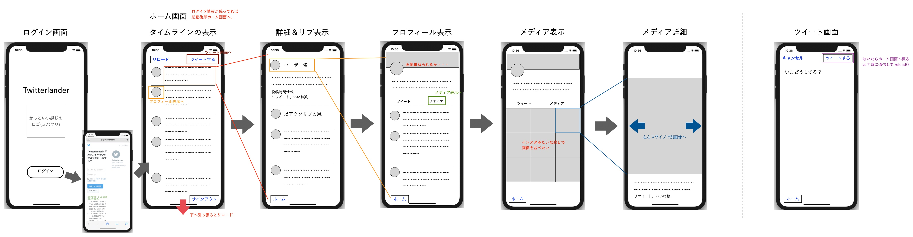
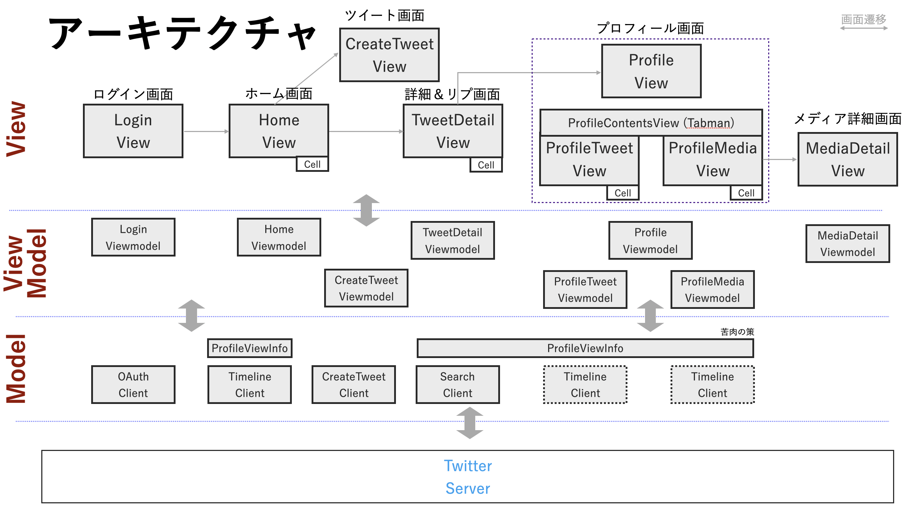

# Twitterlander

## アプリ仕様

### 基本方針

- 究極はTwitterアプリコピー(w/UI)＋画像表示強化
  - 時間的・スキル的に厳しいので最低限機能だけ実装する方針

### 実装する機能

- タイムラインの表示（投稿順）

- 詳細＆リプ表示（各ツイートのタップで）

- プロフィール表示

- - ツイート一覧表示
  - 画像表示（Insta風に表示）

- 文字ツイート

- (Option)いいね、リツイート（引用リツイート含む）

- (Option)共有（メールとかLINEとか？？？）

- (Option)写真付きツイート

- (Option)位置表示ON

### 作成時ルール

- アーキテクチャはMVVMを使用する
- ロジックについては極力テストコードを書きながらTDDで開発する
- Travis CIでPRレビュー時にチェック

## アプリView概要

## アーキテクチャ

